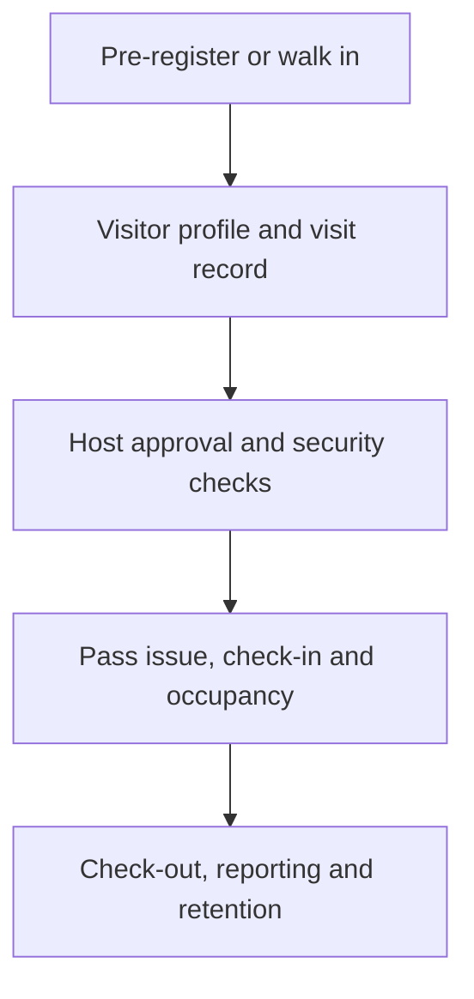
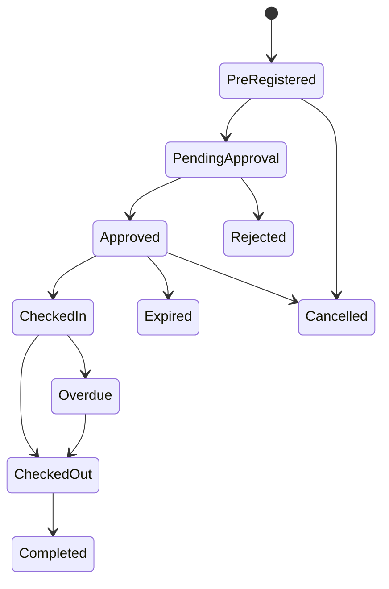
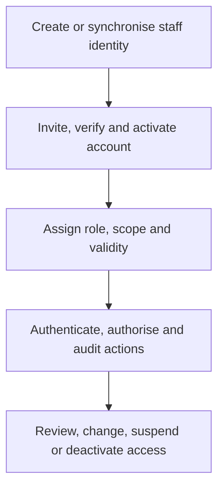

# Gate & Reception Visitor Log System

## Short Scope of Work

### 1. Purpose

Develop a secure, mobile-responsive visitor and vehicle management system for reception desks and security gates. The system will replace manual registers, control visitor entry and exit, maintain a searchable visit history, and provide real-time occupancy and management reports.

The proposed interface will follow the shared design: a simple station dashboard showing **Visitors Today**, **Vehicles Today**, quick registration actions, recent activity, searchable visitor/vehicle logs, status filters, and Excel report export.

### 2. Full Access-Control Requirements

#### 2.1 Access-control model

The system shall use **role-based access control (RBAC)** combined with organisation, site, station, department, ownership and physical-zone restrictions. Access must be denied by default and granted only through an active role assignment.

Every authorisation decision must check:

1. Is the user account active and authenticated?
2. Does the user have the required permission?
3. Is the user assigned to the relevant organisation and site?
4. Is the user assigned to the relevant gate/reception station or department?
5. Is the requested record within the user's ownership or data scope?
6. Is the action allowed for the record's current workflow status?
7. Does the visit authorise entry to the requested physical zone and time window?

Permissions shall be enforced by the API/server, not only by hiding buttons in the interface.

#### 2.2 Access scopes

| Scope | Meaning |
|---|---|
| Global | Access across all organisations, sites and stations. Reserved for the Platform Administrator. |
| Organisation | Access to all sites belonging to one organisation. |
| Site | Access only to an assigned branch, office or facility. |
| Station | Access only at an assigned reception desk or security gate. |
| Department | Access to visits involving an assigned department. |
| Own records | A host sees only visits addressed to them or created by them. |
| Assigned records | A user sees only visits specifically allocated to them for action. |
| Physical zone | A visitor may enter only the buildings, floors or restricted areas approved for the visit. |

A user may hold more than one assignment, but permissions must never cross organisations unless Global access is explicitly authorised.

#### 2.3 System roles

| Role | Definition and permitted access |
|---|---|
| Platform Administrator | Manages platform-level organisations, subscriptions, global configuration and technical support. Cannot casually browse visitor personal data; support access must be authorised, time-limited and audited. |
| Organisation Administrator | Manages the organisation's sites, departments, stations, users, roles, hosts, visitor categories, approval rules, notifications and retention settings. Can view organisation-wide reports and audits. |
| Site Administrator | Manages users, hosts, stations, badges and settings for assigned sites only. Can view site-wide logs and reports but cannot change organisation-wide security rules. |
| Security Manager | Oversees physical access operations for assigned sites; views live occupancy, approves security exceptions, manages incidents and watchlists, reviews denied access, performs roll calls and exports security reports. |
| Security Supervisor | Monitors assigned stations, reviews pending and overdue visits, approves operational exceptions, reassigns visits, corrects records with reasons and reviews guard activity. |
| Receptionist / Security Guard | Registers visitors and vehicles, performs permitted verification, requests host approval, checks approved visitors in/out, issues/receives badges and views operational records for assigned station/site. Cannot delete records, manage users, view full audit logs or export unrestricted personal data. |
| Employee / Host | Pre-registers visitors, approves/rejects visits addressed to them, receives arrival alerts, views their own upcoming/current/history records and confirms that a visitor has left. Cannot view visits for other hosts. |
| Department Approver | Approves visits for an assigned department when the named host is unavailable or department approval is required. Cannot approve visits outside that department. |
| Management Viewer | Read-only access to approved dashboards and aggregated reports for assigned organisation/sites. Personal fields must be masked unless specifically authorised. |
| Auditor / Compliance Officer | Read-only access to authorised records, access reviews, exports and immutable audit logs. Cannot register, approve, edit, check in/out or administer users. |
| Emergency Officer | Read-only access to current on-site visitors, emergency contacts where authorised, zones and evacuation/roll-call functions. No access to historical visits or unrelated personal details. |

No user may approve their own exceptional access request, alter their own role, or remove evidence of an action they performed. Administrator roles are non-operational by default. If an administrator must work at a gate or reception desk, they must receive a separate, scoped operational role.

#### 2.4 Permission matrix

Legend: **A** = allowed within assigned scope; **R** = read-only; **O** = own records only; **E** = exception/authorised escalation only; **—** = prohibited.

| Function | Org Admin | Site Admin | Security Manager | Supervisor | Guard / Reception | Host | Dept Approver | Management | Auditor | Emergency |
|---|:---:|:---:|:---:|:---:|:---:|:---:|:---:|:---:|:---:|:---:|
| View dashboard | A | A | A | A | A | O | R | R | R | Current only |
| Register walk-in visitor | — | — | A | A | A | — | — | — | — | — |
| Pre-register visitor | — | — | A | A | A | O | O | — | — | — |
| View visitor details | R | R | A | A | A | O | Dept | Masked | R | Minimum |
| Edit pending registration | — | — | A | A | A | O | — | — | — | — |
| Correct checked-in/completed record | — | — | E | E | — | — | — | — | — | — |
| Approve/reject normal visit | — | — | E | E | Request only | O | Dept | — | — | — |
| Approve restricted-zone visit | — | — | A | E | — | — | — | — | — | — |
| Override rejection/watchlist | — | — | E | — | — | — | — | — | — | — |
| Check visitor in/out | — | — | A | A | A | — | — | — | — | — |
| Issue/return badge | — | — | A | A | A | — | — | — | — | — |
| Register/check vehicle in/out | — | — | A | A | A | — | — | — | — | — |
| View current occupancy | A | A | A | A | A | O | Dept | R | R | A |
| Run emergency roll call | R | R | A | A | R | — | — | R | R | A |
| Manage watchlist | — | — | A | Propose | Match alert only | — | — | — | R | — |
| View watchlist reason | — | — | A | A | Restricted | — | — | — | — | — |
| Manage users/roles | A | Site | — | — | — | — | — | — | R | — |
| Manage sites/stations/settings | A | Site | — | — | — | — | — | — | R | — |
| View operational reports | A | A | A | A | Limited | O | Dept | R | R | Current only |
| Export personal data | E | E | A | E | — | — | — | Masked | R | — |
| View audit trail | A | Site | A | Assigned staff | Own actions | Own actions | Own actions | — | R | — |
| Configure retention/security | A | — | — | — | — | — | — | — | R | — |

“Policy” means the organisation configures whether administration or security approval is required. Every exception must capture the approver, reason, date/time and supporting reference.

#### 2.5 Physical access rules

- Define sites, buildings, gates, floors and zones such as **Public**, **Reception**, **Staff Only**, **Restricted** and **High Security**.
- Each visitor type must have a default zone policy, maximum visit duration and approval path.
- A visit approval must specify the valid site, allowed zone(s), date and entry window.
- Restricted or high-security zones require a Security Manager or another configured second approver.
- Visitors must be visibly badged and, where required, escorted by an assigned employee.
- A badge/QR pass must be unique, time-limited, non-transferable and invalid after checkout, rejection, cancellation or expiry.
- Re-entry after checkout requires a new authorisation or an explicitly enabled same-day multi-entry pass.
- The system must block duplicate active check-ins, expired visits, lost/blocked badges and access at an unapproved site or station.
- Watchlist matches must restrict the visible reason to authorised security staff and trigger the configured review process; matching alone must not permit a guard to bypass policy.
- Emergency override access must be limited to designated roles, require a reason and produce a high-priority audit alert.

#### 2.6 Record-level access and data protection

- Hosts see only visits addressed to them or created by them.
- Guards see operational records for their assigned site/station and shift as configured.
- Management receives aggregated data by default; phone, ID, photo, signature and watchlist information must be masked.
- Search results must reveal only fields the user is permitted to view.
- Full ID numbers should not be stored unless required by approved policy. If stored, display only a masked form to ordinary users.
- Photos, signatures, attachments, watchlist data and emergency contacts require separate permissions.
- Report exports must apply the same field masking and row scope as on-screen views.
- Each export must record the user, purpose, filters, row count, timestamp and file format.
- Records under legal hold or investigation cannot be changed or deleted through normal retention processes.

#### 2.7 Record changes and deletion

- Pending records may be edited by their creator and authorised operations staff.
- Once checked in, identity, approval, entry and badge fields become locked.
- Authorised corrections must create a new version containing the old value, new value, reason, user and timestamp.
- Visit events and audit records are append-only and cannot be overwritten.
- Operational roles cannot permanently delete visitor, vehicle or audit records.
- Approved retention jobs may archive, anonymise or delete eligible personal data according to policy while retaining non-identifying audit evidence.
- Bulk update, bulk export and retention actions require elevated permission and confirmation.

#### 2.8 Account and authentication controls

- Every staff member must use an individual account; shared guard/reception accounts are prohibited.
- Accounts must have a unique username/email, staff identifier, organisation, site/station assignment, role, status and validity period.
- MFA is mandatory for Platform Administrators, Organisation Administrators, Security Managers and remote privileged access; it should be configurable for other users.
- Passwords must be securely hashed, never displayed, and protected with failed-login throttling and temporary lockout controls.
- Sessions must use secure cookies/tokens, expire after inactivity and be invalidated at logout, password reset, account deactivation or role change.
- Privileged users must re-authenticate before changing roles, security settings, watchlists, retention rules or performing sensitive exports.
- Temporary staff accounts must have an expiry date. Dormant accounts must be automatically disabled according to policy.
- User access must be reviewed periodically and immediately removed when a person leaves or changes duties.

#### 2.9 Segregation of duties

- A user cannot assign or approve their own privileged role.
- A host cannot grant restricted-zone access unless separately authorised for that role.
- Guards can request an override but cannot approve their own request.
- Watchlist creation and watchlist override should be performed by different authorised users where practical.
- System administrators manage configuration; auditors independently review actions and evidence.
- Technical support access must be explicitly approved, time-bound and visible in the audit log.

#### 2.10 Audit and access review

The system must audit successful and failed login attempts, password/MFA changes, user and role assignments, permission denials, visitor/vehicle creation, approvals, rejections, watchlist matches, overrides, check-in/out, badge activity, record corrections, searches of sensitive information, report views/exports, retention actions and configuration changes.

Each audit event must contain the acting user, role, organisation/site/station, action, target record, result, date/time, device/session or source IP where appropriate, reason, and before/after values for changes. Audit logs must be tamper-resistant, searchable by authorised users, retained according to policy and regularly reviewed for unusual activity.

### 3. Core Functional Requirements

#### A. Visitor Registration

- Register walk-in or pre-booked visitors.
- Support visitor categories including guest, contractor, supplier, delivery/courier, interview candidate, VIP, group/event attendee and emergency service personnel.
- Capture full name, phone number, organisation, visitor type, person/department being visited, purpose, expected duration and arrival method.
- Verify an ID without storing a full ID copy by default; where policy requires it, capture only the minimum authorised ID details.
- Optional visitor photo, signature and acknowledgement of safety/privacy terms.
- Search returning visitors and reuse approved basic details to speed up registration.
- Detect duplicates, expired invitations, denied visitors and watchlist matches.
- Support group registration under one organiser while keeping an individual entry/exit record for each attendee.
- For a child or vulnerable visitor, record the responsible adult/guardian and apply the organisation's approved consent and safeguarding process.

#### B. Visit Approval and Entry

- Notify the employee/host of a visitor by in-app alert, email or SMS.
- Allow the host or authorised officer to approve or reject the visit with a reason.
- Allow hosts to send invitations containing directions, visit date/time, privacy notice, safety instructions and a time-limited pre-registration link or QR code.
- Support single, recurring and multi-day visits, subject to configurable expiry and revalidation rules.
- Status workflow: **Pre-registered → Pending Approval → Approved → Checked In → Checked Out/Completed**, with **Rejected**, **Cancelled**, **Denied** and **Overdue** exceptions.
- Issue a unique visitor pass, badge number or QR code after approval.
- Record gate/station, check-in time, processing user and access area authorised.
- Prevent entry when approval or required verification is incomplete.
- Escalate unanswered approvals to a delegate, department approver or security supervisor after a configurable period.
- Reconfirm or cancel approval automatically when the host is absent, the visit window expires or the approved site/zone changes.

#### C. Check-out and Occupancy

- Check out using name, phone, badge or QR scan.
- Record exit time, exit station, processing user and returned badge/pass.
- Show all visitors currently on-site and highlight overdue visits.
- Provide an emergency roll call/evacuation list of visitors currently inside.
- Allow an authorised supervisor to close an uncompleted visit after investigation, with a mandatory reason and audit record.
- Record evacuation roll-call results as **Accounted For**, **Not Yet Accounted For**, **Left Site** or **Unknown**, without altering the original access events.

#### D. Vehicle Management

- Capture number plate, vehicle type, make, colour, driver and associated visitor/host.
- Record vehicle entry and exit times and gate/station.
- Search by plate number and show repeat or watchlisted vehicles.
- Optionally record parking bay and passengers.
- Support delivery vehicles, fleet vehicles and trailers, with optional permit number and delivery/reference details.

#### E. Logs, Search and Dashboards

- Dashboard cards for visitors today, vehicles today, currently inside, pending approvals, overdue visits and rejected/denied entries.
- Recent activity feed and notifications.
- Visitor and vehicle tabs with filters for date, site, station, host, status and visitor type.
- Search by visitor name, phone, organisation, host, badge or vehicle plate.
- A record timeline must show registration, approval, entry, edits and exit.

#### F. Reports

- Daily, weekly, monthly and custom-date reports.
- Reports by visitor, vehicle, host, department, site/station, status and visit purpose.
- Current occupancy, overstayed visitors, denied access, frequent visitors and peak-time reports.
- Preview and export authorised data to Excel/PDF.
- Scheduled email reports may be added as a later enhancement.

#### G. Administration

- Manage organisations, branches/sites, gates, reception desks and guard stations.
- Manage users, roles, departments, hosts, visitor categories, visit purposes and badge inventory.
- Configure approval rules, notification templates, visit time limits and data-retention periods.
- Maintain visitor/vehicle watchlists with reason, validity dates and restricted visibility.

#### H. Contractor, Supplier and Delivery Controls

- Capture sponsoring department, company, job/reference number, work location and supervisor.
- Require configured documents such as induction acknowledgement, permit, insurance or certification before approval; store only what policy permits.
- Track document validity and block or escalate expired documentation.
- Provide a fast delivery/courier flow that records sender/recipient, item reference and proof of handover without giving unnecessary building access.

#### I. Badge and Pass Lifecycle

- Maintain a badge inventory with available, issued, returned, lost, damaged and blocked states.
- Prevent concurrent issue of one badge to multiple active visitors.
- Alert on unreturned badges and allow replacement fees or incident references where the organisation uses them.
- Immediately invalidate lost, blocked, expired or returned QR/badge credentials.

#### J. Incident and Exception Management

- Record refused entry, suspicious activity, lost badge, overstaying, property/delivery dispute and emergency events.
- Link an incident to the relevant visitor, vehicle, visit, station and staff actions.
- Restrict incident narratives and attachments to authorised security/compliance roles.
- Support assignment, status, severity, follow-up notes and closure evidence without changing the original visitor log.

#### K. Integrations and APIs

- Provide documented, authenticated APIs or webhooks for approved integrations.
- Support optional employee-directory/HR synchronisation for hosts, email/SMS notifications, calendar invitations, badge printers, QR scanners and access-control hardware.
- Treat turnstile, biometric, ID scanner, CCTV and ANPR integrations as separate approved work packages because they introduce additional security and privacy requirements.
- Make integration failures visible and retryable without creating duplicate visitors, passes or events.

### 4. Security, Privacy and Audit Requirements

- Encrypt all traffic with HTTPS and protect stored sensitive data.
- Apply role, organisation, site and station checks on the server for every request.
- Maintain append-only audit logs for login attempts, approvals, rejections, check-ins, check-outs, edits, exports and administrative changes.
- Do not allow operational users to permanently delete visit history; corrections require a reason and retain the original value.
- Display a privacy notice at data collection and capture only information required for access control.
- Apply an organisation-approved retention schedule and automatically archive or delete records when the period expires, unless records are under investigation or legal hold.
- Restrict and log report downloads; mask sensitive fields for read-only or limited roles.
- Provide backups, recovery procedures, monitoring, rate limiting and protection against failed-login attacks.
- Perform a data-protection impact assessment before production use and document the purpose, lawful basis, data fields, recipients, storage location, retention period and risks for each visitor-data category.
- Provide an authorised process for access, correction, objection, restriction and erasure requests, subject to security, investigation and legal-retention exceptions.
- Record visitor acknowledgement of the privacy notice separately from optional consent; do not use consent where another lawful basis is intended.
- Confirm whether the deploying organisation and service provider must register as a data controller and/or processor with Zambia's Data Protection Commission.
- Obtain the required approval before storing or processing personal data outside Zambia where applicable.
- Establish a documented personal-data breach response process with detection, containment, assessment, notification and evidence preservation responsibilities.

### 5. Main System Screens

1. Login / password recovery / MFA
2. Station dashboard
3. New visitor / returning visitor registration
4. New vehicle registration
5. Host approval queue
6. Visitor and vehicle activity logs
7. Visitor/vehicle details and event timeline
8. Check-in, badge issue and check-out
9. Current occupancy / emergency roll call
10. Reports and exports
11. Users, roles, sites, stations and settings
12. Audit logs and watchlist management
13. Contractor/document verification
14. Badge inventory and lost-pass management
15. Incident and exception management
16. Privacy requests and retention/legal-hold administration

### 6. Non-Functional Requirements

- Responsive web application suitable for desktop, tablet and mobile devices.
- Fast registration with clear large controls for gate/reception use.
- Reliable low-bandwidth operation; optional offline capture and later synchronisation can be Phase 2.
- Date/time displayed in Africa/Lusaka timezone while audit timestamps are safely stored.
- Pagination and indexed search for large log volumes.
- Compatibility with current Chrome, Edge, Safari and Android browsers.
- Automated tests for permissions, workflow transitions, duplicate check-in, reports and audit logging.
- Accessible forms, labels, colour contrast, keyboard navigation and clear status indicators aligned to WCAG 2.2 AA where practical.
- Configurable English-first interface with support for future localisation.
- Target 95th-percentile response time of no more than 2 seconds for normal dashboard, search and save operations under the agreed load, excluding third-party services.
- No duplicate check-in, badge issue or approval event when a request is retried.
- Automated encrypted backups, restore testing and documented recovery targets. Recommended starting targets: **RPO 15 minutes** and **RTO 4 hours**, subject to business approval.
- Health monitoring, error alerts, integration retry queues and administrator-visible service status.
- Production, test and development environments must be separated; production personal data must not be copied into testing unless formally approved and protected.
- Centralised configuration, versioned database migrations, secure secret management and rollback procedures.

### 7. Key Data Entities

Organisation, Site, Building, Zone, Station, Department, User, Role, Permission, Role Assignment, Employee/Host, Host Delegate, Visitor, Visitor Category, Visit, Group Visit, Approval, Check-in/Check-out Event, Vehicle, Badge/Pass, Contractor Document, Incident, Watchlist Entry, Notification, Privacy Notice Acknowledgement, Attachment, Legal Hold, Privacy Request, Audit Log, Integration Event and Report Export.

### 8. Deliverables

- Approved requirements and workflow specification.
- Responsive reception/security user interface based on the supplied screenshots.
- Web application, secure API and database.
- Role and permission configuration.
- Visitor, vehicle, approval, occupancy, reporting and administration modules.
- Test results, deployment guide, user guide and basic administrator training.
- Data-protection impact assessment support, data-flow diagram, retention schedule and role/access matrix.
- Backup/restore procedure, operational handover, acceptance-test results and agreed support/warranty terms.

### 9. Recommended Phase 1 Boundary

Phase 1 should include multi-site access, visitor/vehicle/contractor/delivery registration, host approval and escalation, check-in/out, QR or badge lifecycle, live occupancy, emergency roll call, activity logs, essential incidents, reports, audit trail, notifications, privacy notice, retention controls and backup/restore.

Phase 2 should include offline synchronisation, advanced contractor compliance, group/event import, calendar/HR integrations, scheduled reports, self-service kiosks and badge-printer automation. Turnstiles, biometrics, ID scanners, CCTV and ANPR should be separately assessed and approved before implementation.

### 10. Minimum Acceptance Criteria

Phase 1 will be considered ready for acceptance when:

1. Users cannot view or perform actions outside their assigned role, organisation, site, station, department or ownership scope.
2. A visitor cannot be checked in without the approvals and verification required by the configured visitor/zone policy.
3. Duplicate active visits, duplicate badge issue, expired passes and unauthorised-zone entry attempts are blocked and audited.
4. Check-in/out, approval, rejection, correction, override and export events produce complete, tamper-resistant audit records.
5. The current-occupancy list matches active check-ins and supports an emergency roll call.
6. Search, on-screen views and exports consistently apply field masking and row-level permissions.
7. Lost or returned passes become unusable immediately.
8. Failed notifications/integrations retry safely without duplicate business events.
9. Retention, legal hold, privacy-request and authorised deletion/anonymisation processes pass agreed tests.
10. Backup restoration, permission tests, workflow tests, security testing and user acceptance testing complete successfully with no unresolved critical defects.

### 11. Portals, Functions and Sidebar Links

The solution should be one role-aware application with separate portal layouts. Sidebar links must be generated from the authenticated user's permissions and data scope.

#### 11.1 Platform Administrator Portal (`/platform`)

Purpose: manage the complete multi-organisation platform.

| Sidebar link | Main function |
|---|---|
| Dashboard | Platform usage, organisations, active users and system alerts. |
| Organisations | Create, activate, suspend and manage client organisations. |
| Plans & Subscriptions | Manage service plans, limits and subscription status. |
| Platform Users | Manage platform administrators and technical support users. |
| System Health | Monitor APIs, database, background jobs and notifications. |
| Integrations | Configure shared email, SMS and technical service providers. |
| Support Access | Request controlled, time-limited organisation support access. |
| Global Audit Logs | Review platform-level security and administrative actions. |
| System Settings | Configure global security and application settings. |

#### 11.2 Organisation and Site Administration Portal (`/admin`)

Purpose: configure the organisation, sites, users and access policies.

| Sidebar link | Main function |
|---|---|
| Dashboard | Organisation statistics and configuration alerts. |
| Sites & Branches | Manage offices, facilities and branches. |
| Buildings & Zones | Define buildings, floors and physical access zones. |
| Stations & Gates | Configure receptions, entry gates and exit points. |
| Departments | Manage departments and departmental approvers. |
| Employees & Hosts | Maintain employees who may receive visitors. |
| Users | Create, activate, suspend and assign staff accounts. |
| Roles & Permissions | Manage roles, permissions and access scopes. |
| Visitor Categories | Configure guest, contractor, supplier, VIP and delivery types. |
| Approval Workflows | Configure host, department and security approvals. |
| Badge Inventory | Manage available, issued, lost, damaged and blocked badges. |
| Notifications | Configure email, SMS and in-app templates. |
| Reports | View authorised organisation and site reports. |
| Privacy & Retention | Manage privacy notices, retention and legal holds. |
| Integrations | Configure HR, calendar, messaging and approved hardware services. |
| Audit Logs | Review authorised administrative activity. |
| Settings | Organisation branding, timezone and operational settings. |

#### 11.3 Security Management Portal (`/security`)

Purpose: supervise security operations, approvals and exceptions.

| Sidebar link | Main function |
|---|---|
| Operations Dashboard | Live visitors, vehicles, approvals and alerts. |
| Live Occupancy | People currently inside by site and zone. |
| Approval Queue | Security and restricted-zone approval requests. |
| Exceptions | Expired visits, denied access and override requests. |
| Visitors | Search authorised visitor records. |
| Vehicles | Monitor vehicle entry, exit and parking. |
| Contractors | Review contractors and required documentation. |
| Watchlist | Manage restricted visitors and vehicles. |
| Badge Management | Issue, block, replace and reconcile badges. |
| Incidents | Record, assign, investigate and close incidents. |
| Overdue Visits | Monitor visits exceeding approved duration. |
| Emergency Roll Call | Start and manage evacuation attendance. |
| Stations & Shifts | Monitor stations and guard activity. |
| Security Reports | Generate occupancy, denial and incident reports. |
| Activity Audit | Review actions performed by security personnel. |

#### 11.4 Guard and Reception Portal (`/station`)

Purpose: process daily visitor and vehicle entry and exit.

| Sidebar link | Main function |
|---|---|
| Dashboard | Today's visitors, vehicles, occupancy and alerts. |
| New Visitor | Register a walk-in visitor. |
| New Vehicle | Register a vehicle and occupants. |
| Expected Arrivals | View approved and pre-registered visitors. |
| Pending Approvals | Track visitors awaiting approval. |
| Check-in | Verify approval, issue a badge and record entry. |
| Check-out | Record exit and badge return. |
| Visitor Logs | Search visitor activity. |
| Vehicle Logs | Search vehicle entry and exit history. |
| Deliveries | Register couriers, parcels and handovers. |
| Badge Desk | View available, issued, lost and unreturned badges. |
| Overdue Visitors | View visitors who should have left. |
| Report Incident | Submit an incident or access exception. |
| Current Occupancy | View people currently inside the assigned site. |
| Emergency List | Open the restricted emergency occupancy view. |
| My Activity | View the user's shift actions. |
| More | Profile, station selection, notifications, help and logout. |

Recommended mobile navigation: **Dashboard**, **Visitors**, **Quick Add**, **Notifications** and **More**.

#### 11.5 Employee and Host Portal (`/host`)

Purpose: invite, approve and monitor visitors addressed to an employee.

| Sidebar link | Main function |
|---|---|
| Dashboard | Expected, pending and currently visiting guests. |
| Invite Visitor | Create and send an invitation. |
| My Visitors | View the host's upcoming and historical visitors. |
| Approval Requests | Approve or reject visit requests. |
| Visitors On-site | View the host's visitors currently inside. |
| Recurring Visits | Manage recurring or multi-day visits. |
| Group Visits | Register meetings, events and attendee groups. |
| My Delegates | Assign a temporary host or department delegate. |
| Notifications | Arrival, rejection and overdue notifications. |
| My Profile | Contact, department and notification preferences. |

#### 11.6 Management Portal (`/management`)

Purpose: provide read-only operational and management intelligence.

| Sidebar link | Main function |
|---|---|
| Executive Dashboard | Organisation-wide visitor and security indicators. |
| Live Occupancy | Current occupancy with approved data masking. |
| Visitor Analytics | Trends, purposes and peak visiting periods. |
| Vehicle Analytics | Vehicle traffic and parking trends. |
| Site Comparison | Compare activity across branches and facilities. |
| Host & Department Reports | Visitor activity by host or department. |
| Exceptions Summary | Overdue, rejected and denied visit summaries. |
| Incident Summary | Incident trends and current status. |
| Reports | Generate authorised management reports. |
| Scheduled Reports | Configure recurring reports for approved recipients. |
| Export History | Review management report exports. |

#### 11.7 Audit and Compliance Portal (`/compliance`)

Purpose: independently review security, privacy and access-control evidence.

| Sidebar link | Main function |
|---|---|
| Compliance Dashboard | Access reviews, privacy requests and audit alerts. |
| Audit Trail | Search immutable system and user activity. |
| User Access Review | Review users, roles, scopes and last activity. |
| Privileged Access | Review administrators and temporary support access. |
| Approval & Override Logs | Review approvals, rejections and exceptions. |
| Export Logs | Review who exported information and why. |
| Privacy Requests | Track access, correction, restriction and erasure requests. |
| Retention & Legal Holds | Review retention processing and protected records. |
| Incident Review | Review authorised incident and breach-response records. |
| Data Processing Register | Document processing purposes and data categories. |
| Compliance Reports | Generate audit and regulatory reports. |
| Evidence Export | Produce authorised investigation evidence. |

#### 11.8 Emergency Operations Portal (`/emergency`)

Purpose: provide a simplified, restricted interface during emergencies.

| Sidebar link | Main function |
|---|---|
| Emergency Dashboard | Active events and people currently on-site. |
| Current Occupancy | Visitors currently inside each site. |
| Start Roll Call | Create a new evacuation attendance event. |
| Roll Call | Mark each visitor's roll-call status. |
| Zone View | View visitors by last recorded zone. |
| Unresolved Persons | View visitors not yet accounted for. |
| Emergency Contacts | View authorised host and emergency contacts. |
| Previous Events | Review completed emergency roll calls. |
| Print/Export | Produce an emergency occupancy list. |

#### 11.9 Visitor Self-Service and Kiosk Portal

Purpose: allow visitors to pre-register, check in and check out without access to staff functions.

Recommended routes are `/visit/invite/:token`, `/kiosk/check-in` and `/kiosk/check-out`.

The guided flow is: scan invitation QR or enter reference; confirm host and visit; enter or verify details; review privacy and safety information; provide approved photo/signature when required; submit check-in; wait for approval; receive or print a pass; and check out. The kiosk must automatically clear the session and return to its welcome screen after each visitor.

### 12. Visitor and System-User Data Journeys

#### 12.1 Visitor data journey

| Stage | Main actor | Data processed | System action and output |
|---|---|---|---|
| 1. Invitation or walk-in | Host, visitor or reception | Visit date/time, host, purpose, visitor name and contact | Creates a draft/pre-registered visit or starts walk-in registration. |
| 2. Visitor identification | Visitor and reception | Name, phone, organisation, visitor type and minimum authorised ID verification details | Searches for an existing visitor, prevents duplicates and creates/updates the visitor profile. |
| 3. Privacy and requirements | Visitor | Privacy acknowledgement, safety acknowledgement and optional authorised photo/signature | Records the applicable notice version, date/time and acknowledgement. |
| 4. Visit creation | Host or reception | Site, station, department, host, purpose, vehicle, expected duration and requested zones | Creates a visit instance linked to the visitor profile; status becomes **Pre-registered** or **Pending Approval**. |
| 5. Approval | Host, department approver or security | Approval decision, permitted zone, validity window, escort requirement and reason | Records each approval step; status becomes **Approved**, **Rejected**, **Cancelled** or remains pending. |
| 6. Security validation | Security or automated rules | Watchlist result, visit expiry, site/zone policy, duplicate active visit and required documents | Allows processing, blocks entry or sends the visit for authorised exception review. |
| 7. Check-in | Reception or guard | Arrival time, entry station, badge/QR, vehicle and processing user | Creates an immutable entry event, activates the pass and adds the visitor to live occupancy. |
| 8. On-site visit | Security and host | Current status, approved zone, incident/overdue alerts and optional movement events from approved integrations | Maintains current occupancy, notifies the host and records relevant security events. |
| 9. Check-out | Reception or guard | Exit time, exit station, badge return and processing user | Creates an immutable exit event, invalidates the pass, removes the visitor from occupancy and marks the visit **Completed**. |
| 10. After the visit | Authorised management, auditor and retention service | Visit history, operational metrics, audit records, incidents and retention category | Produces masked reports; retains, anonymises, archives or deletes eligible personal data according to policy and legal hold. |

##### Visitor record separation

| Record | Purpose | Important rule |
|---|---|---|
| Visitor Profile | Reusable identity and contact information for a person. | Must not be duplicated for every visit; changes are audited. |
| Visit | One planned or actual visit to a specific site and host. | Each visit has its own purpose, approval, zone, status and validity window. |
| Approval | Host, department or security decision. | Decision, approver, reason and timestamp are immutable. |
| Visit Event | Check-in, checkout, cancellation, denial, expiry and other state changes. | Append-only; existing events are never overwritten. |
| Badge/Pass Assignment | Links a physical badge or QR credential to the visit. | Only one active holder; invalid after return, loss, block or expiry. |
| Vehicle Visit | Vehicle and occupant details for that visit. | Linked to the visit rather than permanently assuming the same driver. |
| Privacy Acknowledgement | The notice/safety version shown to the visitor. | Store version, language, channel and time; do not mix it with optional consent. |
| Incident | Security exception linked to the visitor/visit. | Restricted visibility and separate lifecycle from the visit record. |
| Audit Event | Evidence of who viewed or changed sensitive records. | Tamper-resistant and unavailable for operational deletion. |

##### Visitor status journey

Rejected, denied, cancelled and expired visits must remain visible to authorised users as historical outcomes; they must never appear as active occupancy.

#### 12.2 System-user data journey

System users include administrators, security managers, supervisors, guards, receptionists, hosts, managers, auditors and emergency officers.

| Stage | Main actor | Data processed | System action and output |
|---|---|---|---|
| 1. User source | Organisation admin or approved HR integration | Staff ID, name, work contact, department, job status and manager | Creates a pending user identity within the correct organisation. |
| 2. Invitation | System and staff member | Time-limited activation link, delivery status and expiry | Sends an activation invitation without creating an active session. |
| 3. Identity activation | Staff member | Verified work contact, password and MFA registration where required | Activates the account only after required verification and policy acceptance. |
| 4. Access assignment | Authorised administrator and approver | Role, organisation, site, station, department, data scope, start date and expiry date | Creates a versioned role assignment; privileged assignments require approval. |
| 5. Authentication | Staff member | Username, password/MFA result, session/device information and failed attempts | Issues a secure session or refuses access; records the authentication result. |
| 6. Authorisation | API/access-control service | User status, permission, tenant/site/station scope, record ownership and requested action | Allows or denies each request on the server; denial events are auditable. |
| 7. Operational activity | Authenticated user | Visitor actions, approvals, searches, exports, settings and reasons | Creates business records plus an audit event tied to the acting user and active role. |
| 8. Access review | Administrator, manager and auditor | Last activity, current roles, temporary access, conflicts and dormant status | Confirms, adjusts, expires or suspends access with review evidence. |
| 9. Role or employment change | HR/administrator | New department/site/job status and effective date | Removes outdated access before granting the new scoped role; invalidates active sessions. |
| 10. Offboarding | HR/administrator | Termination date, account state, open assignments and owned workflows | Immediately deactivates the account, revokes sessions/tokens, reassigns pending work and preserves audit evidence. |

##### Core system-user records

| Record | Main fields | Lifecycle rule |
|---|---|---|
| User Identity | Organisation, staff ID, name, work email/phone, department and status | One identity per staff member per organisation; never reuse an old user's account. |
| Authentication Account | Password hash, MFA methods, failed attempts, lock state and session metadata | Secrets are protected; sessions are revoked after critical account changes. |
| Role Assignment | Role, scope, site/station/department, effective dates and approver | Versioned and time-bound; historical assignments remain auditable. |
| User Session | Session identifier, issued/expiry time, device/source and revocation state | Automatically expires and is invalidated on logout, deactivation or security change. |
| Access Review | Reviewer, assignment reviewed, decision, evidence and next review date | Required periodically and after job/site changes. |
| Audit Event | Acting user, active role, action, target, result, time and source | Append-only and retained according to the approved audit policy. |

#### 12.3 Shared data-governance rules

- Every record must carry an organisation identifier; site/station identifiers are added where applicable to prevent cross-tenant or cross-site access.
- Business records use stable internal identifiers rather than phone numbers, badge numbers or ID numbers as database keys.
- Visitor profiles and individual visits are stored separately so returning visitors can be recognised without merging unrelated visits.
- User identity, authentication credentials, role assignments and audit records are stored as separate security concerns.
- Sensitive fields are encrypted or otherwise protected at rest, masked in interfaces and excluded from logs.
- Each system action records the authenticated user, active role, scope, timestamp and outcome.
- Corrections create a new version or corrective event; they do not erase the original evidence.
- Reports use the least amount of personal data needed and inherit the user's row- and field-level permissions.
- Production data must not be used in development or testing without formal approval and protection.
- Retention applies by record category: visitor identity, visit events, incidents, attachments, exports and audit logs may require different approved periods.

### Research Basis

This scope reflects recognised practices for physical access authorisation, visitor access records and auditability in [NIST SP 800-53 Rev. 5](https://csrc.nist.gov/pubs/sp/800/53/r5/upd1/final); least-privilege authorisation, secure sessions, HTTPS, tenant isolation and security verification from [OWASP](https://owasp.org/www-project-application-security-verification-standard/); and visitor transparency, data minimisation and retention principles illustrated by the [ICO visitor process](https://ico.org.uk/global/privacy-notice/visitors-to-the-office/). Zambia-specific requirements are informed by the [Data Protection Commission](https://www.dataprotection.gov.zm/), its [official FAQ](https://www.dataprotection.gov.zm/faq/) and the [Data Protection Act, 2021](https://www.dataprotection.gov.zm/download/act-no-3-the-data-protection-act-2021_0/). Final legal, regulatory, retention and cross-border-storage decisions must be confirmed by the deploying organisation's authorised compliance/legal officers.
